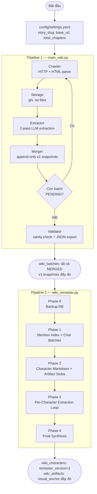
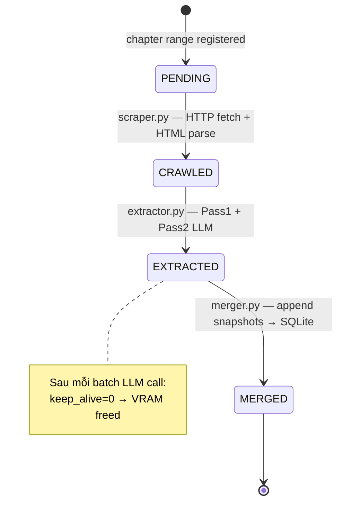
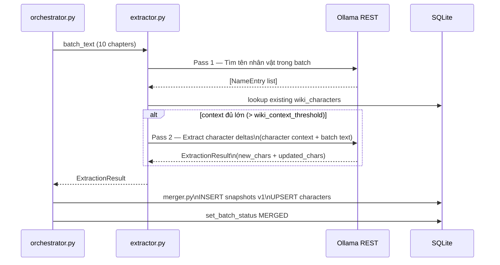
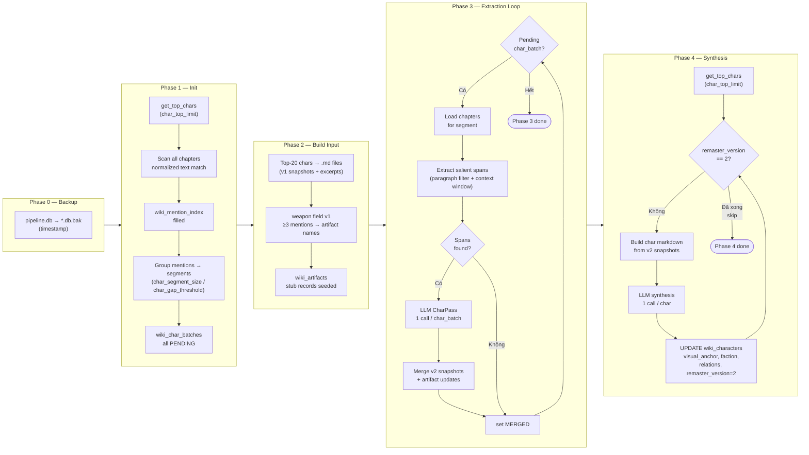
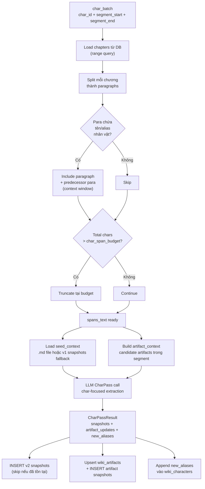
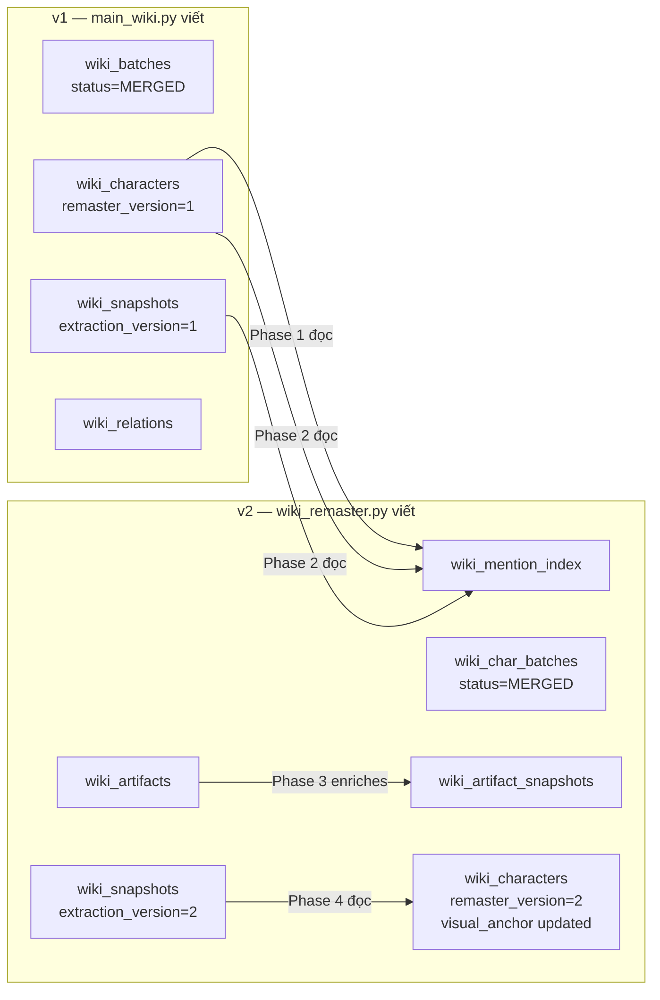
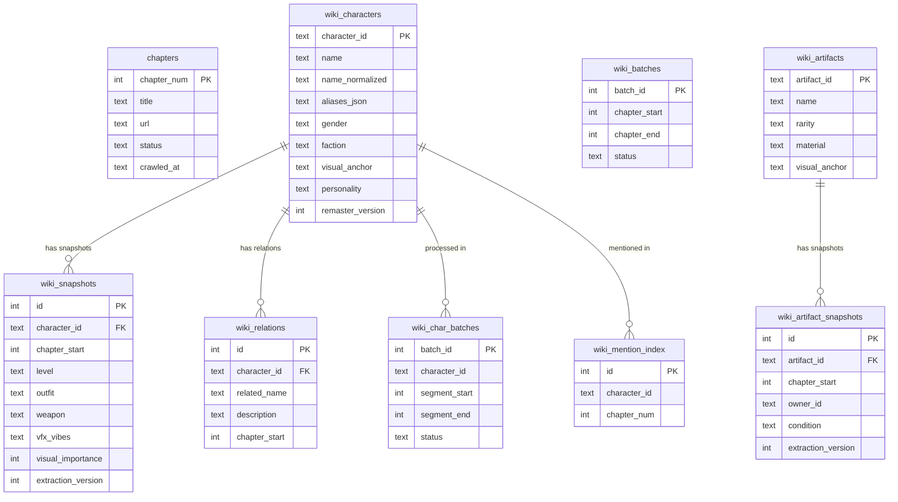

# Story-with-Wiki — Workflow Tổng Quan

Tài liệu mô tả toàn bộ luồng làm việc của project, từ crawl raw text đến wiki nhân vật & pháp khí chất lượng cao.

---

## Tổng quan hai pipeline



---

## Pipeline 1 — main_wiki.py

### Batch State Machine



### 2-pass LLM Extraction (per batch)



---

## Pipeline 2 — wiki_remaster.py

### Phase Flow Tổng Quan



### Phase 3 — Salient Span Extraction



---

## Data Flow — DB Write Pattern



---

## SQLite Schema (ER Diagram)



---

## Safety Guards

| Guard | Vị trí | Hành vi |
|---|---|---|
| Phase 1 reset guard | `main()` — `wiki_remaster.py` | Nếu có char_batches MERGED và `--from-phase 0`, exit lỗi. Dùng `--from-phase 3` để resume hoặc `--from-phase 1` để force reinit |
| Phase 3 resume | `phase3_char_extraction_loop()` | Chỉ xử lý PENDING batches — tự động bỏ qua MERGED |
| Phase 4 resume | `phase4_final_synthesis()` | Skip chars đã có `remaster_version=2` |
| Ollama VRAM | `wiki/extractor.py` | `keep_alive=0` sau mỗi LLM call |

---

## Luồng làm việc điển hình

```bash
# Bước 1: Crawl và extract lần đầu
uv run python3 main_wiki.py

# Theo dõi tiến độ (cửa sổ khác)
watch -n 30 "uv run python3 main_wiki.py --stats"

# Bước 2: Sau khi main_wiki.py xong — chạy remaster
uv run python3 wiki_remaster.py

# Theo dõi Phase 3
watch -n 30 "uv run python3 wiki_remaster.py --stats"

# Nếu bị interrupt — resume an toàn từ Phase 3
uv run python3 wiki_remaster.py --from-phase 3

# Chỉ chạy lại Phase 4 (sau khi Phase 3 xong)
uv run python3 wiki_remaster.py --from-phase 4

# Export kết quả cuối
uv run python3 main_wiki.py --export
```
